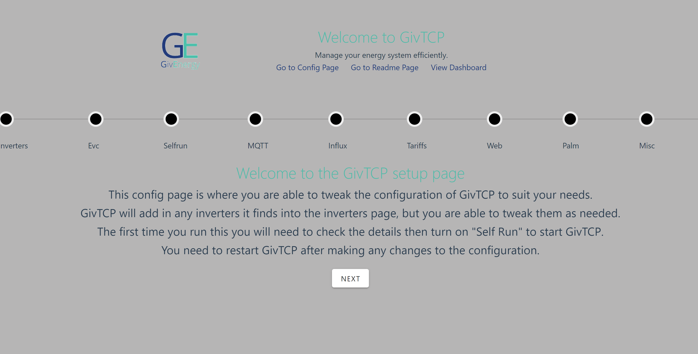
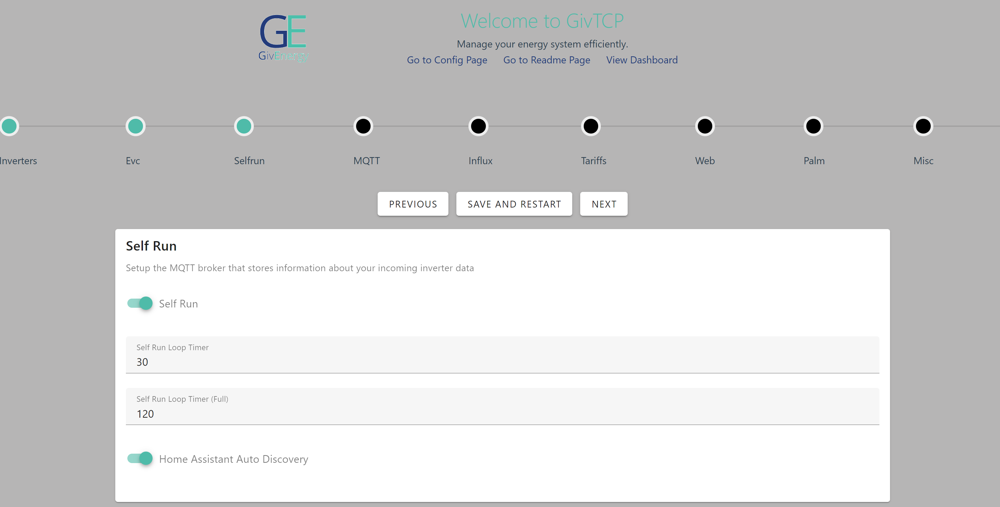
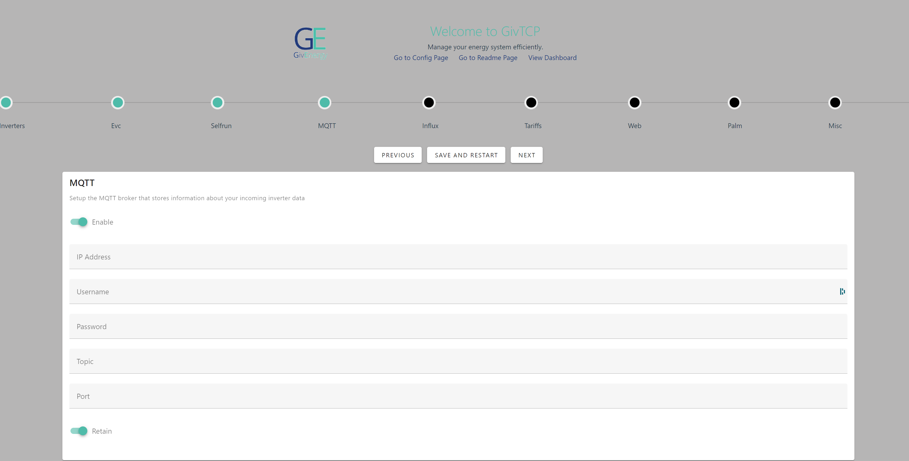
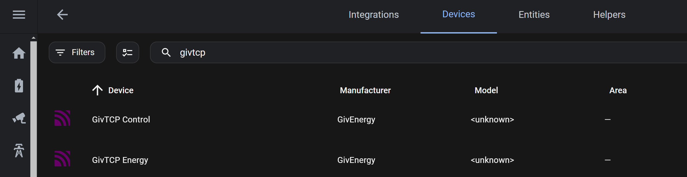
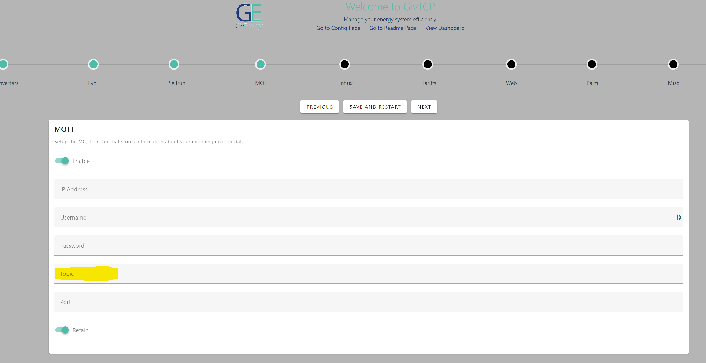

# GivTCP v3
 Version 3 of GivTCP will allow connection to the following GivEnergy Devices:
 - Hybrid inverter
 - AC Coupled inverter
 - Single and Three Phase inverters
 - Gateway (Single or Parallel mode)
 - EMS
 - EV Charger (EVC)
 - All-In-One

This project uses a modbus connection to the GivEnergy devices through the native Wifi/Ethernet dongle and can be connected via either LAN or directly through the inbuilt SSID AP.
GivTCP can auto-discover devices on the network for a (near) zero config setup

Typically run through the Home Assistant Addon, it is also possible to run as a standalone docker container.

## Quick Set-up

### Install GivTCP
#### Addon
 - Add https://github.com/britkat1980/ha-addons to the Addon Store repositories in HA
 - Refresh addon store and click on GivTCP and click install

#### Docker
- Use Docker Compose file to create container

### Run Addon/Container

 - Start the addon/container
 - Check logs for any errors and note the web-config url

### Configure GivTCP

 - Navigate to the web config address (which is typically: http://IPADDRESS:8099/config.html)
 - Step through the config stages, noting that GivTCP should have auto populated inverter and MQTT details
 - Check settings are as you want them
 - Turn on "self_run"
 - HA users - turn on "Home Assistant Auto Discovery"
 - If you are using an MQTT broker outside HA progress to MQTT page to configure MQTT
 - Click "Save and Restart" (if you are running docker you will need to manually restart the container

GivTCP should be publishing data to your MQTT broker and Home Assistant should pick this up automatically.

### (optional) Check Home Assistant

 Once GivTCP has restarted 
 - Go to HA -> Settings -> Integrations -> MQTT
 - Check GivTCP devices have been created
 
You should now have lots of data points and controls available in HA and you can begin to integrate into your smart home.

See [Settings Guide](SETTINGS-GUIDE.md) for more detail on controls available and data points.
  
### Parallel AIO

Users with parallel AIO installations should have 3 (with dual AIO) inverters pre-populated in the "Inverters" page. If any are missing they should be added here. Static / fixed IP addresses should be set for all inverters. The Gateway inverter should be the only inverter that is controlled via GivTCP, the individual AIO inverter data treated for information only.

## Home Assistant Add-on
To install GivTCP as an add-on, add this repository (https://github.com/britkat1980/ha-addons) to the Add-on Store repository list.

The addon assumes HA is running Mosquito as an addon, which also available to install from the Add-on store. GivTCP will automatically connect to it if installed. If not, then you will need to install your own MQTT broker and provide the connection details in the config page

### Home Assistant Usage

GivTCP is designed to run continuously and has a self-run setting, which should be switched on once the settings have been reviewed.
You can change the frequency of the data collection through the config , but its not recommended to drop the self_run loop time to below 30s.

GivTCP will automatically create multiple devices in Home Assistant and you can view them through the Integration page under MQTT.

 
## Other Usage methods:

GivTCP data and control is also available through either MQTT or REST to allow integration into other systems and processes.

### MQTT

By enabling MQTT in the config, GivTCP will publish directly to the nominated MQTT broker all inverter data. Data is published to "GivEnergy/<serial_number>/" by default or you can nominate a specific root topic by setting "MQTT_TOPIC" in the settings.

Control is also available using MQTT. By publishing data to the same MQTT broker as above you can trigger the control methods as per the above table.

Root topic for control is:

"GivEnergy/control/<serial_number>/" - Default (note lower case "control")

"<MQTT_TOPIC>/control/<serial_number>/" - If MQTT_TOPIC is set

  

### RESTful Service

GivTCP provides a REST API for data output and control. REST service is available at: http://IPADDRESS:8099
Each available inverter exposes its REST interface on the following endpoints:

 - /REST1/
 - /REST2/
 - /REST3/
 - /REST4/
 - /REST5/
 You can call REST1/api to discover what api calls are available to you.
  

If Docker is running in Host mode then the REST service is available on port 6345

  

## Web Dashboard

  

You can enable the built-in web dashboard if you'd like a way to visualise data for your inverter(s). This is enabled in the settings page and is found on port 3000.

For more details please see the [ReadMe file in the separate repository](https://github.com/DanielGallo/GivEnergy-Smart-Home-Display/).

The web dashboard is able to summarise data for a single inverter, or multiple inverters in either a single-phase or three-phase environment. If you have any issues or feedback regarding the web dashboard, please post a question or issue [here](https://github.com/DanielGallo/GivEnergy-Smart-Home-Display/issues).

  

## GivEnergy Electric Vehicle Charger (GivEVC)

GivTCP incorporates control and monitoring of the GE charger. Connecting via local modbus it can monitor real-time stats and provide simple control features. With the EVC cloud conrol does not use the modbus protocol, so there is minimal opportunity for changes to reflect in the official app/cloud portal. Particularly the Charging modes, which are merely mimiced in GivEVC.

NOTE - there is currently a firmware bug with the GivEVC where the Modbus port only available on WiFi. Therefore if your EVC is connected via ethernet is will be necessary to disconnect and re-connect via WiFi to recieve data via GivTCP.

### Configuration

  

All that is required for config are the IP address and the self run timer. Setting EVC_ENABLE to True will turn on the function.

  

### Control

  

Most controls are self explanatory but some require clarification on their function:

  

#### Plug and Go:

When turned on the vehicle will start to charge as soon as it is plugged in. When off charging will commence when triggered by RFID card or "Charge Control"

  

#### Charge Control:

This starts and stops vehicle charging, when "Plug and Go" is on.

  

#### Charging Mode:

Mimcs the cloud based "modes" of charging.

  

##### Grid

Charges at current set by "Charge Limit", regardless of what energy is available (typically will pull from Grid)

  

##### Solar

Modulates the Charge Limit based on the amount of "excess solar" available after serving the current house Load. This requires minimum of 1.4kW (6A) excess as required by the EVSE spec.

  

##### Hybrid

This will modulate Charge Limit to top up a base 6A grid charge with any excess solar energy. Similar to Solar but uses a constant 6A from Grid plus additional solar energy on top.

  

#### Max Session Energy

This will cap the maximum energy delivered to the vehicle in a single charge session. Setting this to 0kWh disables this setting.

  

#### Import Cap

This will monitor the Grid current from the first GivTCP inverter and if it is within 5% of the Import Cap setting it will reduce EVC Charge current to stay 10% under the import Cap. Setting this to 0A disables this setting.
